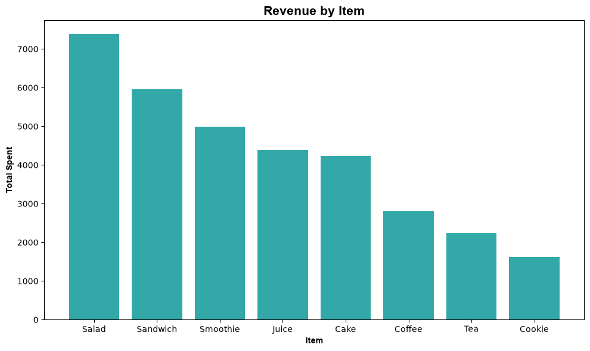
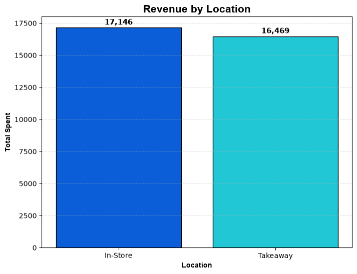
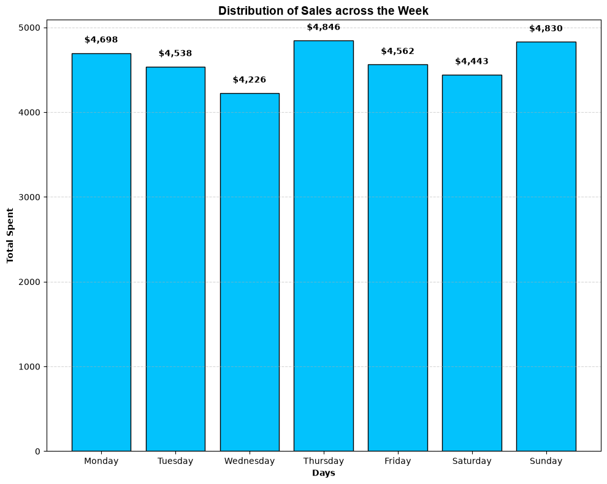
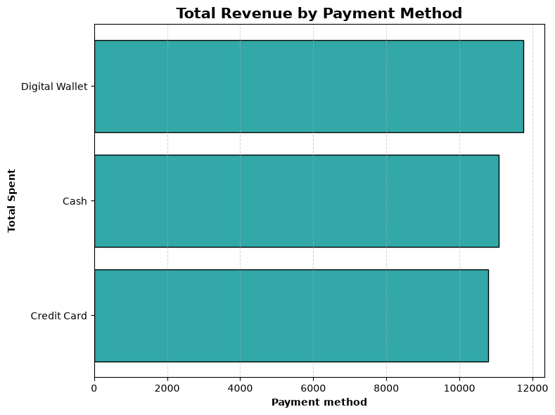
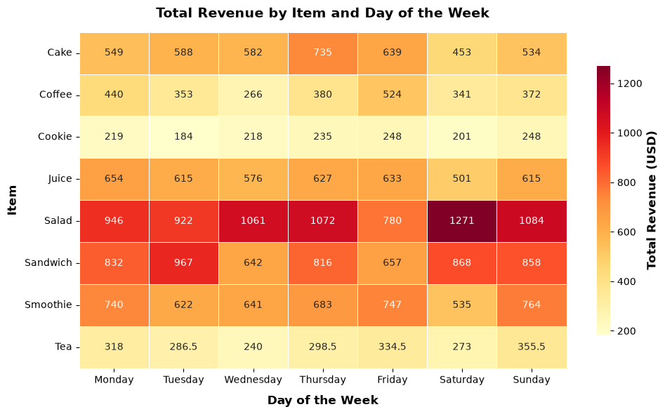

#  Cafe Sales Analysis

## Project Overview

This project presents an end-to-end exploratory data analysis (EDA) of a café sales dataset using Python. Through data cleaning, feature engineering, and visualization, the analysis uncovers customer purchasing patterns, sales trends, and business insights that support data-driven decision-making.


## Business Problem

Cafés generate large volumes of transactional data, but without analysis it is difficult to identify customer preferences, sales trends, and operational opportunities. This project demonstrates how exploratory data analysis can transform raw sales data into actionable business insights.

## Project Objectives

This analysis aims to answer the following questions:

- Which menu items generate the highest revenue?
- Which payment method contributes the most to total sales?
- Which sales location (Takeaway or In-Store) performs better?
- How do sales vary throughout the week?
- What data quality issues exist within the dataset?


## Dataset Description

The dataset contains approximately **10,000 café transactions** with the following attributes:

- Transaction ID
- Transaction Date
- Item Purchased
- Quantity
- Price Per Unit
- Total Spent
- Payment Method
- Location

The dataset contains missing values, invalid entries, and inconsistent formatting, making it suitable for demonstrating real-world data cleaning techniques.


## Skills Demonstrated

Throughout this project, the following data analysis skills were applied:

- Data Cleaning
- Exploratory Data Analysis (EDA)
- Feature Engineering
- Data Validation
- Handling Missing Values
- Data Visualization
- Business Insight Generation
- Python Programming


## Tools & Libraries

- Python
- Pandas
- NumPy
- Matplotlib
- Seaborn
- Jupyter Notebook
- Git & GitHub


## Analysis Workflow

### 1. Data Understanding

- Loaded and explored the dataset
- Examined data types and summary statistics
- Assessed missing values

### 2. Data Cleaning

- Standardized categorical variables
- Converted date and numerical columns
- Handled missing values
- Created additional time-based features
- Validated data quality after cleaning

### 3. Exploratory Data Analysis

The cleaned dataset was analysed to answer the following business questions:

- Revenue generated by each menu item
- Revenue by payment method
- Revenue by sales location
- Sales trends across the days of the week
- Relationships between sales, payment methods, and purchase locations


## Key Visualizations
The following visualizations highlight the key business insights uncovered during the analysis.

### Revenue by Item
This chart compares the total revenue generated by each menu item, helping identify the café's highest- and lowest-performing products.


### Revenue by Location
This visualization compares the total revenue generated from **In-Store** and **Takeaway** purchases, providing insight into which sales channel contributes more to overall revenue.




### Distribution of Sales Across the Week
This chart illustrates how total revenue changes throughout the week, helping identify peak and low-performing sales days that could inform staffing and operational planning.




### Total Revenue by Payment Method
This visualization shows the total revenue generated through each payment method, highlighting customer payment preferences and the contribution of each payment option to overall sales.




### Total Revenue by Item and Day of the Week
This heatmap displays how revenue generated by each menu item varies across the days of the week, making it easier to identify sales patterns and periods of high demand.




## Key Insights

The analysis revealed:

- Salad was the highest revenue-generating menu item.
- Customers preferred Digital Wallets as a payment method.
- In-Store purchases generated slightly higher revenue than takeaway purchases, although the difference was minimal.
- Thursday recorded the highest revenue, followed by Sunday and Monday, while Wednesday generated the lowest sales.
- Data quality issues:
  - Approximately 32% of payment methods were missing.
  - Nearly 40% of transaction locations were unavailable.
  - Around 5% of transaction dates could not be converted because they contained placeholder values.


## Project Structure
```text
Cafe-Sales-Analysis/
│
├── data/
│   ├── dirty_cafe_sales.csv
│   └── dirty_cafe_sales_clean.csv
│
├── notebooks/
│   └── cafe_sales.ipynb
│
├── images/
│   ├── revenue_by_item.png
│   ├── revenue_by_location.png
│   ├── payment_method_revenue.png
│   ├── sales_by_day.png
│   ├── payment_location.png
│   ├── payment_item.png
│   ├── item_location.png
│   └── total_revenue_by_item_day.png
│
├── README.md
├── requirements.txt
└── .gitignore
```

## How to Run the Project

Clone the repository:

```bash 
git clone https://github.com/Blue-bot-g/cafe-sales-analysis.git
```

Navigate into the project folder:

```bash
cd cafe-sales-analysis
```

Install the required libraries:

```bash
pip install -r requirements.txt
```

Launch Jupyter Notebook:

```bash
jupyter notebook
```

Open:

```
cafe_sales_analysis.ipynb
```


## Limitations

Several data quality issues were identified during the analysis:

- Missing values were present in the **Item**, **Payment Method**, and **Location** columns.
- Some transaction dates contained invalid placeholder values and could not be converted into valid dates.
- Time-based analyses were therefore performed using records with valid transaction dates only.

These limitations were documented rather than hidden to ensure transparency throughout the analysis.


## Future Improvements

- Develop an interactive Power BI dashboard.
- Build a sales forecasting model.
- Perform customer segmentation to support targeted marketing.


## Author

**Gertrude Teresia**

Data Analyst passionate about transforming raw data into actionable business insights through Python, SQL, and data visualization.
